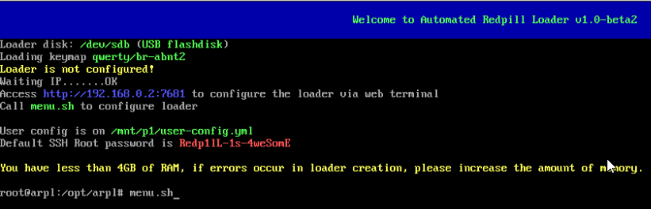
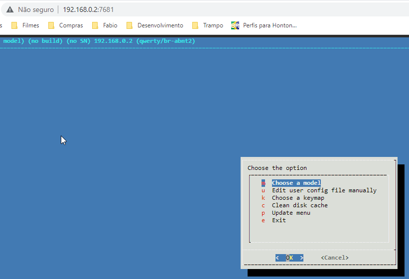
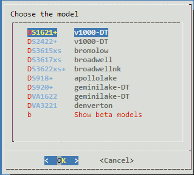
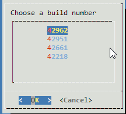
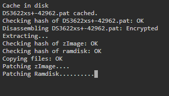

# Automated Redpill Loader

[中文说明](./README.md)

This particular project was created to facilitate my testing with Redpill and I decided to share it with other users.

I'm Brazilian and my English is not good, so I apologize for my translations.

I tried to make the system as user-friendly as possible, to make life easier. The loader automatically detects which device is being used, SATADoM or USB, detecting its VID and PID correctly. redpill-lkm has been edited to allow booting the kernel without setting the variables related to network interfaces so the loader (and user) doesn't have to worry about that. The Jun's code that makes the zImage and Ramdisk patch is embedded, if there is a change in "zImage" or "rd.gz" by some smallupdate, the loader re-applies the patches. The most important kernel modules are built into the DSM ramdisk image for automatic peripheral detection.

# Important considerations

 - Some users have experienced an excessively long time to boot. In this case is highly recommended to use an SSD for the loader in the case of the option via DoM or a fast USB flash drive;

 - You must have at least 4GB of RAM, both in baremetal and VMs;

 - The DSM kernel is compatible with SATA ports, not SAS/SCSI/etc. For device-tree models only SATA ports work. For the other models, another type of disks may work;

 - It is possible to use HBA cards, however SMART and serial numbers are only functional on DS3615xs, DS3617xs and DS3622xs+ models.

# Use

## General

To use this project, download the latest image available and burn it to a USB stick or SATA disk-on-module. Set the PC to boot from the burned media and follow the informations on the screen.

The loader will automatically increase the size of the last partition and use this space as cache if it is larger than 2GiB.

## Acessing loader

### Via terminal

Call the "menu.sh" command from the computer itself.

### Via web

From another machine into same network, type the address provided on the screen `http://<ip>:7681` in browser.

### Via ssh

From another machine into same network, use a ssh client, username `root` and password `Redp1lL-1s-4weSomE`

## Using loader

The menu system is dynamic and I hope it is intuitive enough that the user can use it without any problems.

There is no need to configure the VID/PID (if using a USB stick) or define the MAC Addresses of the network interfaces. If the user wants to modify the MAC Address of any interface, uses the "Change MAC" into "cmdline" menu.

If a model is chosen that uses the Device-tree system to define the HDs, there is no need to configure anything. In the case of models that do not use device-tree, the configurations must be done manually and for this there is an option in the "cmdline" menu to display the SATA controllers, DUMMY ports and ports in use, to assist in the creation of the "SataPortMap", "DiskIdxMap" and "sata_remap" if necessary.

Another important point is that the loader detects whether or not the CPU has the MOVBE instruction and does not display the models that require it. So if the DS918+ and DVA3221 models are not displayed it is because of the CPU's lack of support for MOVBE instructions. You can disable this restriction and test at your own risk.

I developed a simple patch to no longer display the DUMMY port error on models without device-tree, the user will be able to install without having to worry about it.

## Quickstart guide

After booting the loader, the following screen should appear. Type menu.sh and press `<ENTER>`:

If you prefer, you can access it via the web:

Select the "model" option and choose the model you prefer:

Select the "Buildnumber" option and choose the first option:

Go to "Serial" menu and choose "Generate a random serial number".

Select the "Build" option and wait for the loader to be generated:

Select the "Boot" option and wait for the DSM to boot:

The DSM kernel does not display messages on the screen, so it is necessary to continue the process of configuring DSM through the browser by accessing the address `http://<ip>`.
There are several tutorials on how to configure DSM over the internet, which will not be covered here.

# Tutorials

An ARPL user (Rikkie) created a tutorial to install ARPL on a proxmox server:
https://hotstuff.asia/2023/01/03/xpenology-with-arpl-on-proxmox-the-easy-way/

# Troubles/questions/etc

Please search the forums at https://xpenology.com/forum if your question/problem has been discussed and resolved. If you can't find a solution, use github issues.

# Thanks

All code was based on the work of TTG, pocopico, jumkey and others involved in continuing TTG's original redpill-load project.

More information will be added in the future.
